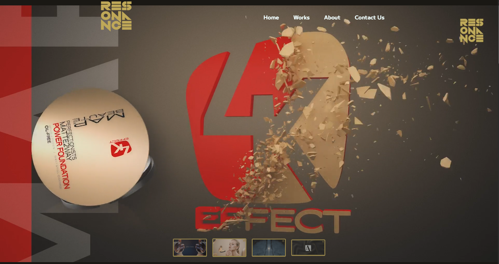

# Resonance — Interactive Website 🎨✨

🚀 A modern, stylish web experience designed with HTML, CSS, and JavaScript.  
This project showcases responsive design, smooth animations, and a polished user interface.

## 🔗 Live Demo

👉 [Click here to view the site](https://resonance-orpin.vercel.app)

## 📸 Preview

## 🔐 Source Code

This project is part of my personal portfolio.  
The full source code is private, but the live demo is publicly accessible for viewing.

---

> Built with ❤️ and curiosity.
